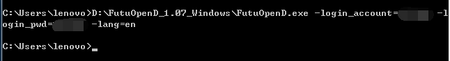
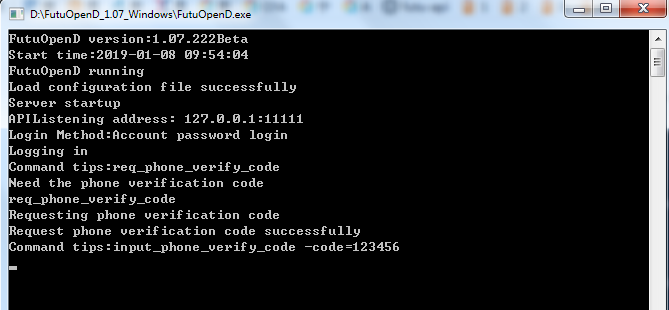
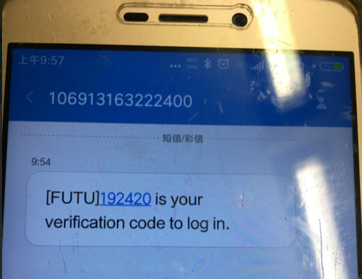
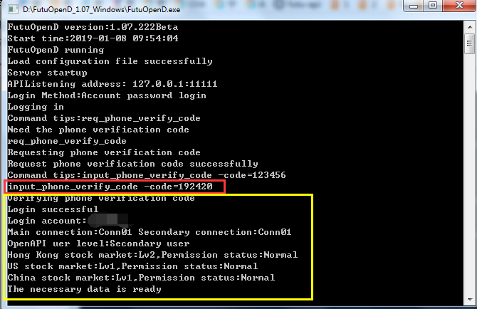

首先pip install futu-api安装futu-api
anaconda 原装的numpy可能有问题与futu-api冲突，需要pip uninstall numpy，再pip install numpy

在dos下，进入FutuOpenD目录输入:D:\\FutuOpenD_1.07_Windows\>FutuOpenD.exe
-login_account=65xxxx -login_pwd=xxx -lang=en

输入手机的验证码 input_phone_verify_code -code=xxx

